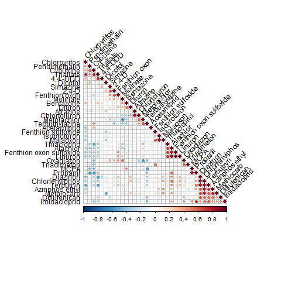

```{r setup, include=FALSE}
knitr::opts_chunk$set(echo = FALSE, warning = FALSE, message = FALSE)
```

```{r Data preparation}
library(readr)
#-< descargar pesticides_Ebro_2020.csv de github a la carpeta data
pesticides <- as.data.frame(read_csv("data/pesticides_Ebro_2020.csv"))
pesticides$bay <- as.factor(pesticides$bay)
pesticides$channel <- as.factor(pesticides$channel)
names(pesticides)[1] <- "site"
row.names(pesticides)<- pesticides$site
```

#Tables

##Table 1
Median and standard deviation concentration in ng/L of the detected individual pesticides and asymmetry analysis in the investigated water samples.

```{r statistics}
library(kableExtra)
options(knitr.kable.NA = " ")
statistics <- as.data.frame(read_csv("./data/statistics_pesticides.csv"),
                            na="empty")
kable(statistics, align = "c") %>%
  kable_styling(bootstrap_options = c("striped"))
```


##Table 2
Pairwise correlations values of the different pesticides detected.

```{r}
#install.packages("corrplot")
source("http://www.sthda.com/upload/rquery_cormat.r")
```

```{r pairwise correlations}
require(stats)
pest_corr <- cor(pesticides[,4:36])
kable(round(pest_corr,2), align = "c") %>%
  kable_styling(bootstrap_options = c("striped"))
```


##Table 3
Principal-components importance of the pesticides patterns from Ebro river Delta.


##Table 4
PCA loadings for the four firsts PCs explaining pesticides contribution of the main sources contamination of data variance.

```{r loadings list}
acp <- prcomp(pesticides[,4:38],
              center=TRUE, #se resta la media de cada variable
              scale=TRUE) #divide por desv tipica
kable(round(acp$rotation[,1:4],3)) %>%
  kable_styling(bootstrap_options = "striped", full_width = F)
```


##Table 5
PCA scores for the four firsts PCs describes the contribution of contamination sources in the samples.

```{r scores list}
kable(round(acp$x[,1:4],3)) %>%
  kable_styling(bootstrap_options = "striped", full_width = F)
```

#Figures
##Figure 1
Correlation plot of pesticide in watters from Ebro river Delta. Red spots indicates significant positive correlation and blue ones, negative corelation. The larger the dot, the stronger the correlation..





##Figure 2

Network plot correlations among pesticides analysed. Green connectors lines represent the strongest significative correlations.

```{r}
library(qgraph)
pest_groups <- qgraph(pest_corr, graph="cor", layout="spring", threshold=0.6)
```


##Figure 3

Pesticides top ten ranked cross-correlations.

```{r raking_corr}
#a ranked cross-correlations package
#devtools::install_github("laresbernardo/lares")
library(lares)
corr_cross(pesticides[,4:38],
           max_pvalue = 0.05,
           top=10)
```

##Figure 4
Loading plots of the main contamination patterns identified by PCA for pesticides in the Ebro river delta and explained variances for each PC.

```{r}
par(mfrow=c(2,2), las=2, cex.names = 0.4, cex.axis=0.5)
barplot(acp$rotation[,1], main = "a) PC1: 22.1%")
barplot(acp$rotation[,2], main = "b) PC2: 15.1%")
barplot(acp$rotation[,3], main = "c) PC3: 12%")
barplot(acp$rotation[,4], main = "d) PC4: 9.7%")
```

##Figure 5
PCA biplot of all analysed pesticides in Ebro river delta. a) PCA biplot for first and second PCs. b) PCA biplot for third and fourth PCs.

```{r general_biplot}
library(factoextra)
par(mfrow=c(2,1))
fviz_pca_var(acp, axes=c(1,2), col.var = "contrib", 
             gradient.cols = c("#00AFBB", "#E7B800", "#FC4E07"), 
             repel = TRUE,
             title="a")
fviz_pca_var(acp, axes=c(3,4), col.var = "contrib", 
             gradient.cols = c("#00AFBB", "#E7B800", "#FC4E07"), 
             repel = TRUE,
             title="b")
```

##Figure 6
Scores plot of the first (a) and second (b) contamination pattern showing the spatial distribution of pesticide pollution.


```{r scores_plot}
bay <- as.numeric(pesticides$bay)
channel <- as.numeric(pesticides$channel)

plot(acp$x[,1],
     pch=c(16,17)[bay],
     col=c("green", "orange")[channel],
     ylab="PC1",
     main="a")
text(acp$x[,1],labels=pesticides$site, pos = c(3, 4)[channel], cex=0.5)
abline(h=0, v=0, lty=4, col="gray")
plot(acp$x[,2],
     pch=c(16,17)[bay],
     col=c("green", "orange")[channel],
     ylab="PC2",
     main="b")
text(acp$x[,2],labels=pesticides$site, pos = c(3, 4)[channel], cex=0.5)
abline(h=0, v=0, lty=4, col="gray")

```

##Figure 7
PCA biplot of amilides, organophosphates, triazines and acidics pesticides in Ebro river delta. a) PCA biplot for first and second PCs. b) PCA biplot for third and fourth PCs.

```{r PCA_biplot_selectedgroups}
fviz_pca_biplot(acp, col.var = "contrib", 
                gradient.cols = c("#00AFBB", "#E7B800", "#FC4E07"),
                select.var = list(name=c("2,4-D", "Bentazone", "MCPA", 
                                         "Diflufenican", "Propanil", 
                                         "Atrazine", "Cybutrine", "Simazine", "Terbutryn",
                                         "Azinphos ethyl", "Chlorfenviphos", "Diazinon", "Malaoxon")),
                repel = TRUE, title="a")
fviz_pca_biplot(acp, axes=c(3,4),
                col.var = "contrib", 
                gradient.cols = c("#00AFBB", "#E7B800", "#FC4E07"),
                select.var = list(name=c("2,4-D", "Bentazone", "MCPA", 
                                         "Diflufenican", "Propanil", 
                                         "Atrazine", "Cybutrine", "Simazine", "Terbutryn",
                                         "Azinphos ethyl", "Chlorfenviphos", "Diazinon", "Malaoxon")),
                repel = TRUE, title="b")

```


